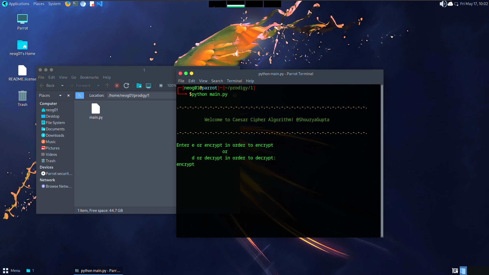

# Implementation of Caesar Cipher
> Prodigy InfoTech Internship (Task_01)

* Create a python program that can encrypt and decrypt text using the Caesar Cipher algorithm.

```

  "Author": "Shourya Gupta",
  "Language": "Python",

```
***
## Task list
- [x] Ask user to enter the choice to encrypt or decrypt the string.
- [ ] Take the user input data.
- [ ] Shift the data according to the number specified by the user.
- [ ] Show the functional cipher output according to the user choice.
- [ ] ask user where he wants to continue or exit.

## Dependencies

```
pip install string colorama
```
## Output Snapshot
